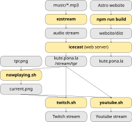

# kute.pona.la: Toki Pona radio

This radio aims to provide good [Toki Pona](https://tokipona.net/) music to anyone, 24/7. You can access it as an internet radio (in the browser or a standalone player), or as a video stream on Youtube or Twitch.

## Contributing

This is a collaborative project brought to you by the Toki Pona community.

<div align="center">
  <a href="https://github.com/pona-la/kute/graphs/contributors">
    
  </a>
</div>

Your help is welcome! Feel free to submit pull requests if you find anything that needs improvement.

Want to help but you're [new to Github? We can help!](https://github.com/pona-la/.github/blob/main/help/README.md)

You can also join the Discord and talk to the maintainers!

<div align="center">
  <a href="https://discord.gg/A3ZPqnHHsy">
    
  </a>
</div>

## Implementation

Overview chart of technology used:



### Icecast2

We use icecast without a proxy, which means the following configuration options need to be set in `/etc/icecast2/icecast.xml`:
```xml
<icecast>
    <listen-socket>
        <port>80</port>
    </listen-socket>

    <listen-socket>
        <port>443</port>
        <ssl>1</ssl>
    </listen-socket>

    <paths>
        <!--
            The bundle is a combination of multiple certificates,
            use Let's encrypt's certbot to generate them.
        -->
        <ssl-certificate>/etc/icecast2/bundle.pem</ssl-certificate>
    </paths>

    <security>
        <changeowner>
            <user>icecast2</user>
            <group>icecast</group>
        </changeowner>
    </security>
</icecast>
```

We also host the website through icecast. To build it, run `npm i && npm run build` in the website directory. On the side of icecast, set the following config options for the website to work:

```xml
<icecast>
    <paths>
        <webroot>/srv/tpr/website/dist</webroot>
    </paths>
</icecast>
```

### Ezstream

The icecast mountpoint is occupied by ezstream. The sample config in the ezstream directory should be kept updated with the changes of the config on the server. We don't keep the config itself there because of the password contained within.

In the future, you can copy the config and create another radio station by occupying another mountpoint with ezstream by running it with another systemd service.

Ezstream utilizes the playlist in `/srv/music/tpr.txt`, which is a list of absolute paths to music files. The music files accepted by ezstream are listed in the configuration file.

### Images

The `images/nowplaying.sh` script is used to generate images of the currently playing song on the background of the `images/tpr.png` image.

### Ffmpeg

The scripts in `ffmpeg` directory are used for streaming the contents of the radio onto various social streaming sites.

## License

Code (`/src/`) is licensed under [GPL-3.0](https://www.gnu.org/licenses/gpl-3.0.en.html).
